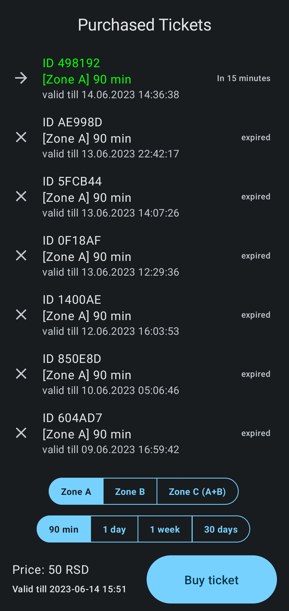

# Prevoz Pay
## About
It's an unofficial simple android app to help people from Belgrade to pay for public transport (Beogradski prevoz) with a simple and convenient way. App will send an SMS and shows the validity status of the current ticket.

You could find more information about new way of payment on the official website [bgnaplata.rs](https://bgnaplata.rs/).

## Downolad
Please downolad and install Prevoz Pay app using [this link](https://disk.yandex.ru/d/ZceDoZ0kJ6VdXg).

## How to use

1. Choose zone (A, B, A+B)
2. Choose duration (90 min, 1 day, 1 week, 1 month)
3. Check price, zone and duration
4. Tap pay button and then an sms will be sent to 9011 with corresponding text.
5. Ticket number, price and expiration date will be shown.

Have a good trip!

### Screnshots

## Feedback

Please leave your comments and feedback to [sotov.dev@gmail.com](mailto:sotov.dev@gmail.com).
